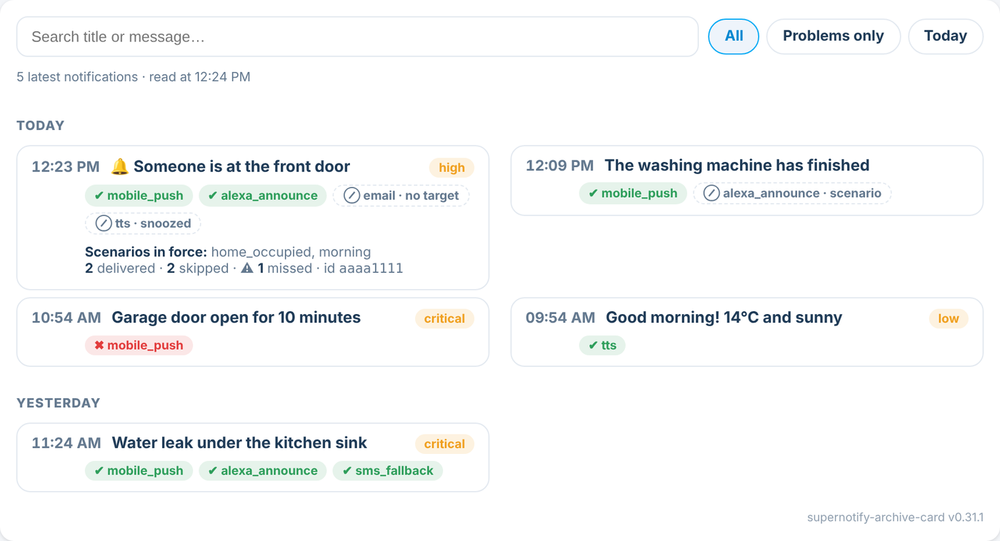

# supernotify-archive-card

[← SuperNotify Cards](../../README.md) · [Common options](../configuration.md)

Notification history, read from the SuperNotify archive, and **why** each one went where it went.



**One card for the list and the detail (0.85.0).** On the left (on top when the card is narrow) one
line per notification: a mark - ✔ arrived, **!** a channel failed or something to look at, ⊘ it
went out on no channel (a pause, nobody home, a rule) - the title, and one line that says how it
went: the failed channel in red, else where it arrived. The priority shows only when it is not
medium. The same notification several times in a row is one line with **×N** (tap it to see each
one). On top: today in one line, the search, and **?** for how to read the card.

On the right (below when narrow) the notification you tap - the latest opens by itself: a verdict
("Arrived on 3 channels of 4 · Telegram failed"), the call, the scenarios in force, who was home,
then every channel with why it went out or not and to whom, the routine skips and the channels not
involved folded, and the pause bar. This is what the separate
[supernotify-why-card](why.md) showed; that card is now an alias of this one.

```yaml
type: custom:supernotify-archive-card
```

| Option | Required | Description |
|---|---|---|
| `limit` | no | notifications in the list (default 150, max 500; before SuperNotify 2.12.1: full documents, default 40, max 100) |
| `source` | no | `sensor` to keep using the command_line bridge below even on SuperNotify 2.10+ |
| `trigger_entity` | no | entity whose change means "a notification was sent" (default `sensor.supernotify_notifications`) |
| `entity` | no | bridge only: sensor holding the archive index (default `sensor.supernotify_archivio`) |
| `intro` | no | info banner at the top of the card |
| `style` | no | `supernotify` (default) or `theme` |
| `pause` | no | `false` hides the pause bar under the detail (default shown when SuperNotify has `supernotify.snooze`) |
| `priority_filters` | no | `false` hides the **Critical** and **High** filters (default shown when the archive has some) |
| `group_repeats` | no | `false` lists every notification on its own line (default: repeats in a row are one "×N" line) |
| `auto_select` | no | `false` waits for a tap instead of opening the latest notification |
| `expand` | no | `true` opens the folded parts of the detail (routine skips, channels not involved, trace) |
| `max_height` | no | any CSS length (e.g. `calc(100vh - 330px)`): list and detail scroll inside it |
| `service` | no | bridge only: service returning the detail (default `shell_command.sn_archive_detail`, see the [why page](why.md)) |
| `pause_sender` | no | `true` also offers the automation or script that sent the notification - needs a SuperNotify whose tag snooze matches the sender ([#270](https://github.com/rhizomatics/supernotify/pull/270)) |

**Pause one notification (0.80.0).** Open a notification: the bar under the detail pauses notifications about the entity
it is about - 30 min, 1 h, 4 h or 24 h, for everyone or only for you - through SuperNotify's tag
snooze. The entity is `entity_id` in the call's `data` (or its camera), so add it to the calls you
want to be able to pause:

```yaml
action: notify.supernotify
data:
  message: "The bathroom thermostat is offline"
  data:
    entity_id: climate.bathroom_thermostat
```

Critical notifications are never paused from here. "Only for me" removes you from the people the
notification goes to; channels with fixed targets (speakers, the dashboard) still play.

**A light list (0.86.0).** On SuperNotify 2.12.1 or later the list is read as summaries
(`enquire_archive` with `verbosity: summary`, about 1 KB a notification instead of about 6 KB), and
only the 20 newest in full - those keep the missed count, the spoken text and the whisper mark in
the list. Any other notification is read in full when you open it. **Critical** and **High** look
in the whole archive (31 days): the card asks SuperNotify how many there are per day
(`verbosity: daily`, shared with the stats card) and then reads only the days that have some; a
finished day is kept in the browser and never read again.

**SuperNotify 2.10.0 or later: nothing to set up.** The card reads the archive through the
`supernotify.enquire_archive` action (the file archive must be on in SuperNotify's options). It
asks for the latest `limit` notifications once, then only for the newest few each time
`trigger_entity` changes, and shares what it read with the why card and the recipients card on
the same page.

### Before SuperNotify 2.10: the command_line bridge

Older versions have no action to read the archive, and a Lovelace card cannot read files
(`media_source` serves only audio/image/video, so a `.json` comes back 404 even with a signed
URL). The card then needs an index of the archive in the attributes of a sensor. Copy
`tools/sn_archive_index.py` to `/config/tools/` and add:

```yaml
command_line:
  - sensor:
      name: "SuperNotify archivio"
      unique_id: supernotify_archivio_indice
      command: "python3 /config/tools/sn_archive_index.py"
      value_template: "{{ value_json.count }}"
      json_attributes: [items, chan, scen, generated, total_files, oldest, error, unreadable]
      scan_interval: 300
      command_timeout: 30

recorder:
  exclude:
    entities:
      - sensor.supernotify_archivio    # ~8 KB of attributes, no reason to store them
```

Optionally trigger a refresh right after each notification instead of waiting for the next
scan, with an automation on `sensor.supernotify_notifications` calling
`homeassistant.update_entity` on the sensor (the engine updates that counter *after* delivery,
so the JSON file is already on disk).

The script takes `--limit` (default 40), `--path` and `--message-chars`; it never raises, so a
missing folder or a corrupt file shows up as an attribute instead of breaking the sensor.

Once you are on SuperNotify 2.10+, the sensor, the automation, the shell command and the script
can all be removed: the cards stop reading them as soon as the action is there.

With the bridge and no `shell_command.sn_archive_detail`, the detail is what the index knows: every
channel with its outcome and reason, the scenarios, the counts.

What a **voice channel said** (Alexa, TTS…) shows under the message when it differs from the text,
named after that channel. SuperNotify keeps the spoken text only for voice transports, so any voice
channel is recognised, whatever its name.
