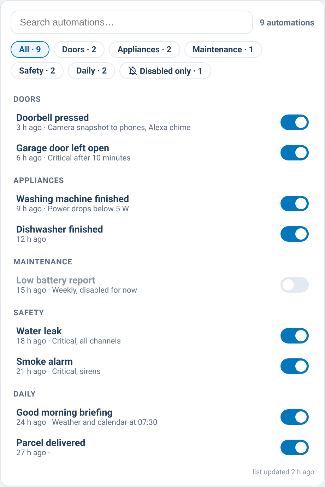

# supernotify-automations-card

[← SuperNotify Cards](../../README.md) · [Common options](../configuration.md)

Live list of the automations that notify via `notify.supernotify`: search,
category filters, a "🔕 disabled only" toggle, state and "last triggered",
enable/disable, tap a row for the automation's own more-info dialog.



Home Assistant does not expose the config of YAML/package automations (they
have no `id`), so discovery is hybrid: [`tools/genera_vista_automazioni.py`](tools/genera_vista_automazioni.py)
(included in this repo, run on the HA host or wherever it can read your
config directory) scans `automations.yaml`/`packages/*.yaml`, finds the
ones calling `notify.supernotify` and writes a JSON manifest to
`config/www/supernotify/automations.json`; the card layers everything live
on top of it (state, last_triggered, enable/disable). Edit the `HA_CONFIG_DIR`
and `CATEGORIES` constants at the top of the script for your own setup
before running it, and rerun it whenever automations are added, removed or
renamed — the card itself only reads the manifest, it never scans anything.

```yaml
type: custom:supernotify-automations-card
# optional:
manifest_url: /local/supernotify/automations.json   # default shown
style: theme
```

⚠️ If the card shows a configuration/loading error, check that the manifest
file actually exists at that URL on your instance — this card depends on it
being generated and copied into `config/www/supernotify/` separately from
the card's own installation.
