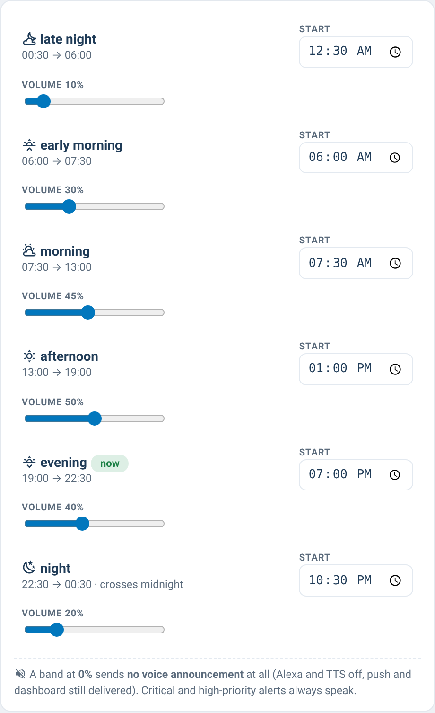

# supernotify-bands-card

[← SuperNotify Cards](../../README.md) · [Common options](../configuration.md)

Time bands editor: one row per band with an "now" badge on the active band
(cross-midnight aware), inline start-time input (`input_datetime`) and
volume slider (`input_number`).



```yaml
type: custom:supernotify-bands-card
bands:                   # config order = chronological order (cyclic)
  early_morning: {start: input_datetime.notifier_start_early_morning, volume: input_number.notifier_early_morning_volume}
  morning:       {start: input_datetime.notifier_start_morning,       volume: input_number.notifier_morning_volume}
  afternoon:     {start: input_datetime.notifier_start_afternoon,     volume: input_number.notifier_afternoon_volume}
  evening:       {start: input_datetime.notifier_start_evening,       volume: input_number.notifier_evening_volume}
  night:         {start: input_datetime.notifier_start_night,         volume: input_number.notifier_night_volume}
  late_night:    {start: input_datetime.notifier_start_late_night,    volume: input_number.notifier_late_night_volume}
# per band, optional: name and icon (emoji); defaults provided for the six standard bands
```
