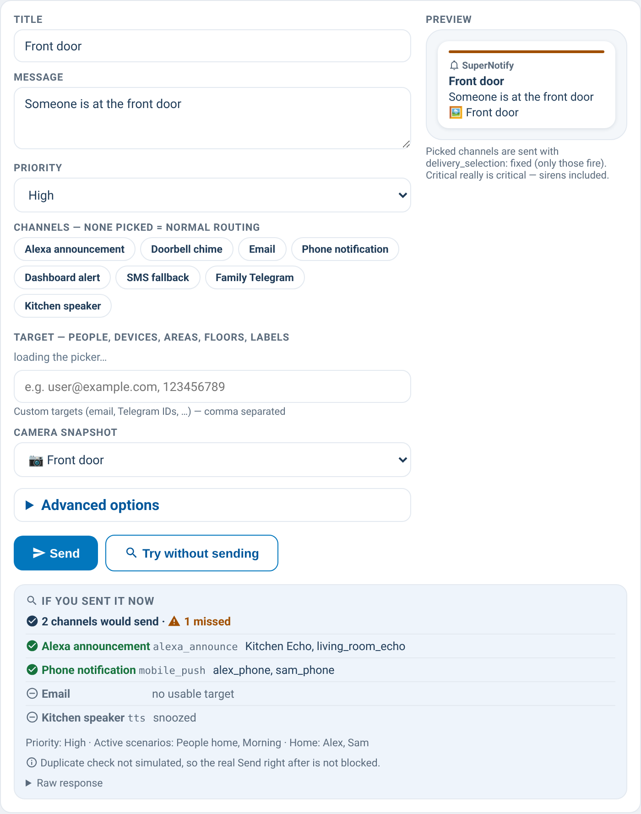

# supernotify-composer-card

[← SuperNotify Cards](../../README.md) · [Common options](../configuration.md)

Try & send: title, message, priority, optional explicit channel chips
(auto-discovered), a native HA **target selector** (people, devices, areas,
floors, labels — the same picker HA itself shows for `supernotify.notify`),
an optional comma-separated **custom targets** field for recipients with no
HA selector (email addresses, Telegram chat IDs, …), camera snapshot picker
and a live phone preview.



Sends via the dedicated `supernotify.notify` action (SuperNotify ≥ 2.3.0) —
typed fields instead of `notify.supernotify`'s generic `data:` — with
`delivery_selection: fixed` when channels are picked, and a confirmation
guard on critical priority. Requires SuperNotify ≥ 2.3.0; on older versions
use `supernotify-control-card`'s Announce tile or your own automation
instead.

⚠️ **Areas, floors and labels are not resolved by every channel.** SuperNotify
only resolves them natively for transports that call an HA entity service —
`notify_entity`, `alexa_devices`, `html5`, `ntfy`, `kodi`, `media_player`,
`tts` and `chime` (see [issue #9](https://github.com/rhizomatics/supernotify/issues/9)
upstream). With any other channel, or with the default/implicit routing when
no channel is picked, a target made only of areas/floors/labels can silently
end up with no recipient at all. The card shows an inline warning in this
case; pick a compatible channel above (the deliveries card flags them) or add
a person/device directly to the target.

**Try without sending** (🔍): shows which channels would send right now and to
whom, which would be skipped and why, missed channels, priority, scenarios in
force and who is home — without sending anything. It uses SuperNotify's dry
run (2.12 or later, [issue #218](https://github.com/rhizomatics/supernotify/issues/218)):
`supernotify.notify` with `dry_run: simulate`. The button shows when
`update.supernotify_update` says 2.12 or later; `dry_run: true` shows it anyway.

By default the dry run skips the duplicate check (`force_resend`): on
2.12.0-beta1 a simulated notification is remembered as sent, so the real Send
right after, with the same text, would be dropped as a duplicate. With
`dry_run_dupe_check: true` the dry run does check duplicates, and the next Send
of the same content carries `force_resend` instead.

**Advanced** (closed by default):

- **Spoken message** — a different text for voice channels (`spoken_message`).
- **Scenarios** — chips to *apply* scenarios to this notification only,
  *require* them (send only if they are active) or *constrain* the channels to
  theirs (`apply_scenarios`, `require_scenarios`, `constrain_scenarios`).
- **Snapshot URL** — a picture by address instead of a camera (`snapshot_url`).
- **Debug** — SuperNotify keeps extra detail on this notification (`debug: true`),
  visible in the why and archive cards.

```yaml
type: custom:supernotify-composer-card
# dry_run: true               # optional: show the button whatever the version
# dry_run_dupe_check: true    # optional: simulate the duplicate check too
# update_entity: update.supernotify_update
```
