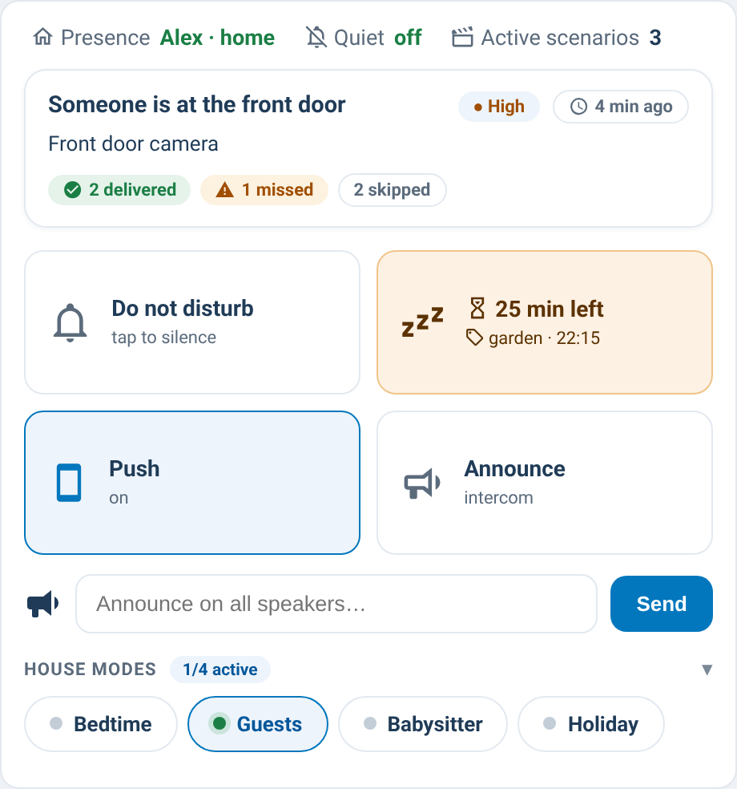

# supernotify-control-card

[← SuperNotify Cards](../../README.md) · [Common options](../configuration.md)

Touch-first control center: status bar, big quick-action tiles and grouped
mode toggles. Implements the "control center" concept from the SuperNotify
UI roadmap (feature #27, statistics and dashboard).



### Configuration

```yaml
type: custom:supernotify-control-card
presence_entity: person.alex
dnd_entity: input_boolean.notifier_dnd
announce_delivery: alexa_announce
snooze_minutes: 30
last_notification: true
last_notification_entity: input_text.supernotify_last_title
repeat_entity: input_button.supernotify_show_last
tiles:
  - dnd
  - snooze
  - toggle: input_boolean.notifier_speech_notifications
    name: Voice
    icon: mdi:account-voice
  - toggle: input_boolean.notifier_phone_notifications
    name: Push
    icon: mdi:cellphone
  - announce
groups:
  - name: Notification channels
    entities:
      - input_boolean.notifier_speech_notifications
      - input_boolean.notifier_phone_notifications
      - input_boolean.notifier_screen_notifications
  - name: Quiet and schedules
    entities:
      - input_boolean.notifier_dnd
      - input_boolean.notifier_holidays
      - input_boolean.notifier_dnd_workdays
  - name: People and home
    collapsed: true
    entities:
      - input_boolean.modo_ospite
      - input_boolean.tata_presente
bands:
  early_morning: {start: input_datetime.notifier_start_early_morning, volume: input_number.notifier_early_morning_volume}
  morning:       {start: input_datetime.notifier_start_morning,       volume: input_number.notifier_morning_volume}
  afternoon:     {start: input_datetime.notifier_start_afternoon,     volume: input_number.notifier_afternoon_volume}
  evening:       {start: input_datetime.notifier_start_evening,       volume: input_number.notifier_evening_volume}
  night:         {start: input_datetime.notifier_start_night,         volume: input_number.notifier_night_volume}
  late_night:    {start: input_datetime.notifier_start_late_night,    volume: input_number.notifier_late_night_volume}
```

| Option | Required | Description |
|---|---|---|
| `presence_entity` | no | `person.*` shown in the status bar |
| `occupancy` | no | without `presence_entity`, the status bar shows who is home for SuperNotify (`enquire_occupancy`, what its conditions see). `false` hides it |
| `snooze_via` | no | how pauses are made: `action` (`supernotify.snooze`, `silence` and `unsnooze`, SuperNotify 2.13.0, any user, full panel), `event` (the push buttons event, needs an admin), `voice` (SuperNotify's voice commands, the user's own pauses). Default: `action` when SuperNotify has it, otherwise `event` for admins and `voice` for everyone else |
| `status` | no | `false` hides the status row (who is home, time band, quiet, active scenarios): for a second control card in the same view. Default `true` |
| `dnd_entity` | no | `input_boolean` used by the DND tile and status bar |
| `announce_delivery` | no | SuperNotify delivery used by Announce (default `alexa_announce`) |
| `snooze_minutes` | no | minutes for the snooze tile (default 30) |
| `snooze_panel` | no | `true` (default): the snooze tile opens a panel to pause non-critical notifications, everything, one channel or one priority, for everyone or only you, for 15 min to 4 h or until resumed, and lists the pauses in force with Resume. `false`: one tap snoozes as before (`snooze_minutes`, `snooze_action`). Pausing goes through `supernotify.snooze` when SuperNotify has it; before that it fires the same `mobile_app_notification_action` event as the push buttons, which needs an admin user. |
| `snooze_announce` | no | `true` says a pause out loud on the announce channel (`announce_delivery`, e.g. Alexa): before pausing, since the pause would stop its own announcement, and after resuming one or all. With a pause for everyone already in force SuperNotify would hold the announcement back, so the card then calls the channel's own action (e.g. `notify.alexa_media`) with its targets and data. Default `false`; a switch in the visual editor |
| `snooze_action` | no | override the snooze command (default `SUPERNOTIFY_SNOOZE_EVERYONE_NONCRITICAL_<minutes>`; e.g. use `..._EVERYTHING_...` to pause critical too) |
| `tiles` | no | list of `dnd`, `snooze`, `announce`, or `{toggle, name, icon}` |
| `groups` | no | grouped `input_boolean` toggles with a `name` |
| `bands` | no | time bands (`input_datetime` start + `input_number` volume) for the status bar |
| `last_notification` | no | `true` shows the native last-notification block (title, message, priority, relative time, how many channels delivered / failed / missed / skipped, and "Why ›" when a why-card is on the dashboard) |
| `last_channels` | no | `true` = one chip per channel in the last-notification block instead of the counts |
| `last_notification_entity` | no | `input_text` holding the last title (fallback when the engine has no title) |
| `last_notification_strip` | no | regex removed from the message, e.g. `\\s*🕐 Ora:.*$` to drop a timestamp line |
| `repeat_entity` | no | `input_button` (or `script`) pressed by the "Repeat" button of the block |
| `collapsible` | no | groups fold on header tap with an active/total counter (default `true`); per-group `collapsed: true` folds by default |
| `tile_columns` | no | force N tile columns (default: as many 150 px tiles as fit, 2 on a phone) |
| `tile_layout` | no | `stacked` = the tall tiles with the icon on top (before 0.52) |

Active scenarios are read from `binary_sensor.supernotify_scenario_*`. Since
SuperNotify 2.4.0 these report a live `on`/`off` state (recomputed reactively
plus a periodic sweep — see `scenario_control` in the SuperNotify config); on
older versions, or for a scenario configured with `expose_state: false`, they
stay `unknown` and the counter hides automatically. The overview-card and
scenarios-card use the same live state for their "active now" count/badge
when it's available, falling back to their polled `enquire_active_scenarios`
check (a `poll_seconds` option, default 60) only on older versions.
From SuperNotify 2.7.0 a scenario also has a `switch.supernotify_scenario_*`
(enabled or not): a scenario counts as active only when its conditions hold
**and** its switch is not off.

The Announce tile calls `notify.supernotify` with
`data: {delivery_selection: fixed, delivery: {<announce_delivery>: {}}}`.

**Pauses in force** show why they were set: *by hand* (the panel or a push button), *by voice* or
*by the assistant*.

**Users who are not admin** can't fire the push buttons event, so for them the panel pauses through
SuperNotify's own voice commands (`conversation/process` with "pause my notifications for 30
minutes", "silence my notifications until I say", "resume my notifications"). Those pause only the
person linked to the user. They work when the voice commands are on in SuperNotify's options;
otherwise the card says so.

**Links to the other cards** (0.65.0): in the status bar, *Home* opens the recipients card and
*Active scenarios* the scenarios card, on the same page or on another view of the same dashboard (0.67.0). The overview's pause row opens
this card's pause panel.
