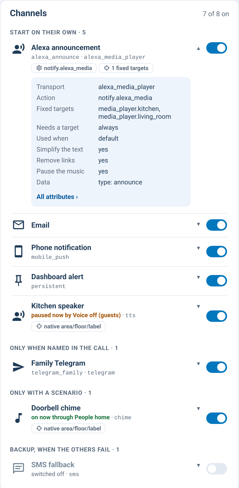

# supernotify-deliveries-card

[← SuperNotify Cards](../../README.md) · [Common options](../configuration.md)

Delivery dashboard, auto-discovered from the entities SuperNotify exposes:
transport icon, selection/action/target tags, enabled badge. A "🎯 native
area/floor/label" tag marks deliveries whose transport resolves an
area/floor/label target natively (`notify_entity`, `alexa_devices`, `html5`,
`ntfy`, `kodi`, `media_player`, `tts`, `chime`) — see the composer card's
target selector note below for why this matters. Tap a row for the full
delivery attributes.



```yaml
type: custom:supernotify-deliveries-card
# optional:
hide_defaults: true     # hide auto-generated DEFAULT_* deliveries (default true)
style: theme
```
