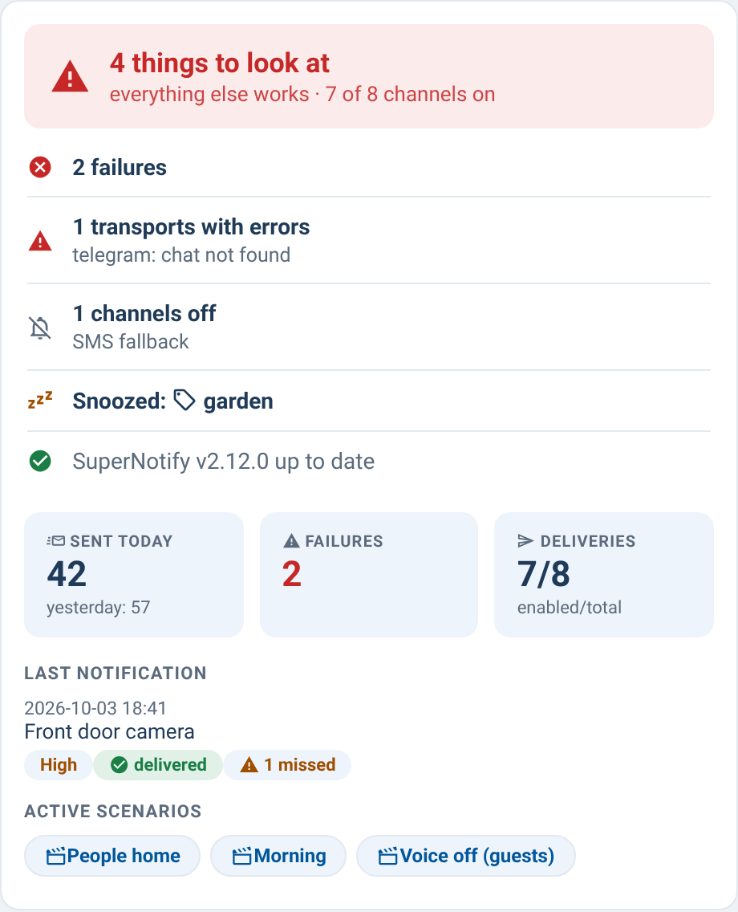

# supernotify-overview-card

[← SuperNotify Cards](../../README.md) · [Common options](../configuration.md)

<!-- CHANGELOG: 2026-10-10 - 0.39.0 layout: status band, numbers from the archive, parts, repeat, scenarios as rows. -->

Dashboard overview shipped in the same bundle: **health** on top — one sentence
("2 things to look at", or "All good" with how many channels are on) and a list
of what to look at, each with its detail and an "Open" link where there is one
(SuperNotify version from the HACS update entity, engine failures, transports
with errors and their last message, channels switched off by readable name, DND
active, active snoozes),
sent and failure counters (`sensor.supernotify_notifications` /
`sensor.supernotify_failures`), active scenarios and last notification (via
the `supernotify.enquire_*` response services over WebSocket) and delivery
counts. Transport status lives in the transports card.



## The 0.39.0 layout (bundle 0.88.0)

Each piece of information in one place, colour only for the state:

- **Status band**: the state on the left (green all fine, orange something to look at, red an
  error), what to look at in the middle with its own button - **▶ Resume** on a pause (all of them
  when there are several), **Open ›** on repairs, errors and channels off - and on the right the
  versions of SuperNotify and of the cards, with a **?** that opens the legend (`help: false` hides it).
- **Four numbers** from SuperNotify's archive (`enquire_archive` `verbosity: daily`, one call for
  the last 30 days, SuperNotify 2.12.1+): **Today** (duplicates left out, as in the stats card) with
  yesterday and the 30-day average; **Delivered today** with the duplicates dropped, the failed
  channels today and in 30 days; **Channels** on / total with "see which"; **Silence**: active pauses
  and do-not-disturb (`quiet_entity`). An older SuperNotify keeps the numbers of before.
- **Last notification**: the time in its title, **🔁 Repeat** (`repeat_entity`, e.g. the
  `input_button` your repeat automation listens to) and **Why ›** - the archive card on this page,
  or the view where it is.
- **Active scenarios** as rows - name and what it silences or turns down - and one line with the
  effect now ("voice off on Alexa · off: TTS").

`parts:` picks the blocks - `status`, `numbers`, `last`, `occupancy`, `scenarios` (all by default) -
so two overview cards can split them across a dashboard; each reads only what it shows:

```yaml
# a sections view: state and numbers on top at full width, "now" on the left, trends on the right
sections:
  - type: grid
    column_span: 3
    cards:
      - type: custom:supernotify-overview-card
        parts: [status, numbers]
        quiet_entity: binary_sensor.notifier_dnd
  - type: grid
    cards:
      - type: custom:supernotify-overview-card
        parts: [last, occupancy, scenarios]
        repeat_entity: input_button.supernotify_show_last
  - type: grid
    column_span: 2
    cards:
      - type: custom:supernotify-stats-card
        kpis: false
        versions: false
```

```yaml
type: custom:supernotify-overview-card
# optional:
poll_seconds: 60        # refresh interval for enquire_* data
health: true            # health sentence + list on top (false = hide, chips = the pre-0.52 chips)
stats: full             # all five numbers (default: sent, failures, channels)
last_notification: true    # show it even with a control card on the page (false = never)
occupancy: false       # hide "Who is home"
repairs: false         # leave SuperNotify's repairs out of the health list
update_entity: update.supernotify_update   # HACS update entity for the version chip
cards_update_entity: update.supernotify_cards_update   # 0.39.0: newer cards available? (the version shown is the one running)
repeat_entity: input_button.supernotify_show_last      # 0.39.0: Repeat on the last notification (input_button, button or script)
parts: [status, numbers, last, occupancy, scenarios]  # 0.39.0: the blocks to draw
help: true              # 0.39.0: "?" with the legend in the status band
quiet_entity: binary_sensor.notifier_dnd   # your DND sensor, for the 🌙 chip
sent_today_entity: sensor.supernotify_sent_today   # optional daily utility_meter for "sent today"; without it (0.69.0+) the long-term statistics of sensor.supernotify_notifications
style: theme            # follow the HA theme instead of the SuperNotify look
```

The **last notification** block reads like the control card's: title, message, priority, how long ago,
then "2 delivered · 1 missed · 2 skipped" (hover for the channel names) and **Why ›** when a why card
is on the dashboard. With a control card on the same view that shows it, the overview leaves it out
(0.65.0); `last_notification: true` or `false` decides instead.

**Who is home** comes from SuperNotify (`enquire_occupancy`): the people at home and away, and the
occupancy its conditions see (everyone home, only one home, some at home, everyone away). It is
what decides `occupancy:` in your channels, which can differ from the `person.*` states (an unknown
tracker counts as home).

**SuperNotify's repairs** (admin users) join the health list with their title and an Open link to
Settings › Repairs. Ignored repairs are left out.

**Links to the other cards** (0.65.0), when they are on the same page or, from 0.67.0, on another view of the same dashboard (that view opens): *transports with errors* and
*channels off* get **Show ›**, which opens that card on those rows; a pause opens the control card's
pause panel; a person opens the recipients card, an active scenario the scenarios card.
From 0.78.0 each active scenario chip also says what it silences or turns down (*Late Night · 🔇 Alexa, TTS*)
and shows its conditions as tooltip.
