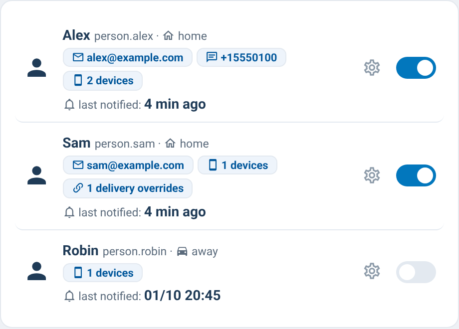

# supernotify-recipients-card

[← SuperNotify Cards](../../README.md) · [Common options](../configuration.md)

Recipients dashboard, auto-discovered: home/away state from the linked
`person.*` entity, contact tags (email, phone, devices, delivery overrides)
and a live on/off switch. Warns when a recipient has no contact points.
On SuperNotify ≥ 2.7.0 each recipient is read from its
`switch.supernotify_recipient_*` and toggled with `switch.turn_on/turn_off`
(the deprecated `binary_sensor` mirror is ignored); older versions fall back
to the `binary_sensor`.



```yaml
type: custom:supernotify-recipients-card
# optional: style: theme
```
