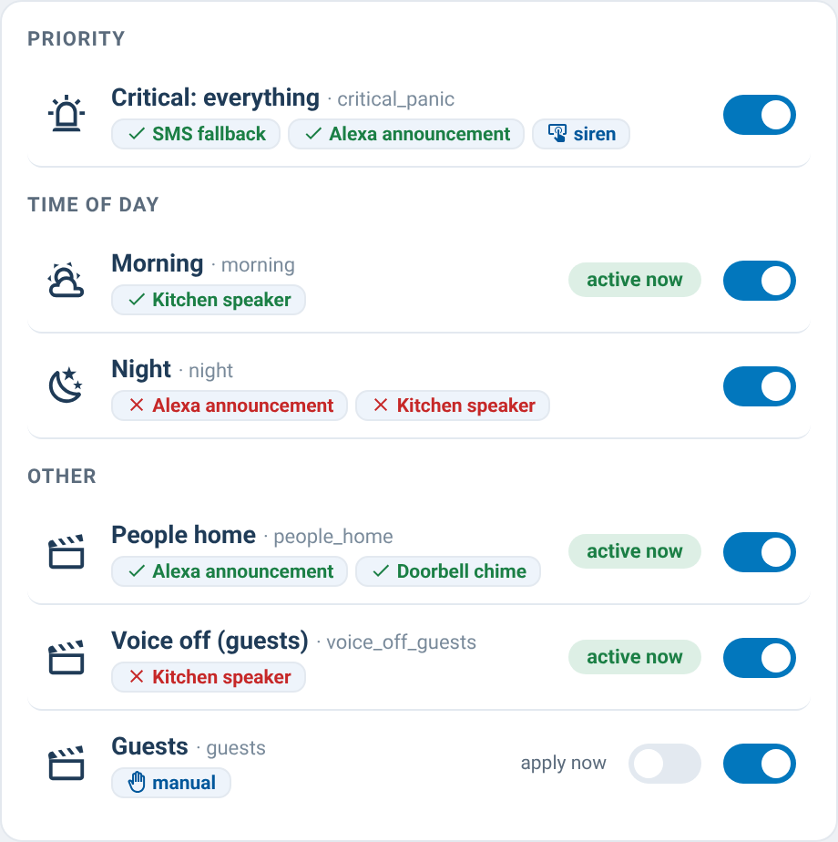

# supernotify-scenarios-card

[← SuperNotify Cards](../../README.md) · [Common options](../configuration.md)

Scenarios dashboard, auto-discovered: "active now" badge (live from
`binary_sensor.supernotify_scenario_*`, polled from `enquire_active_scenarios`
on older versions), a live on/off switch per scenario (SuperNotify ≥ 2.7.0,
`switch.supernotify_scenario_*`), per-delivery override tags (enabled/disabled),
action groups and media tags. Optional `groups` reproduce categories.



```yaml
type: custom:supernotify-scenarios-card
# optional:
groups:
  - name: 🚨 Priority
    scenarios: [critical_panic, high_priority, alexa_low_whisper]
  - name: 🕐 Time bands
    scenarios: [early_morning, morning, afternoon, evening, night, late_night]
# scenarios not listed fall into an "Other" group
```
