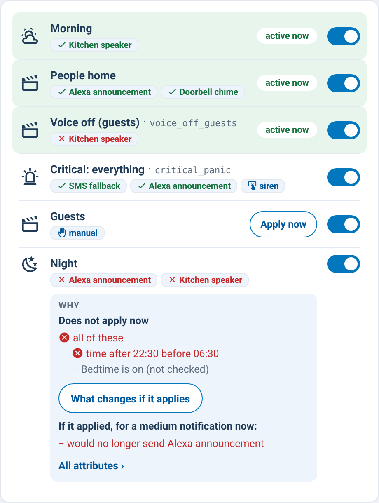

# supernotify-scenarios-card

[← SuperNotify Cards](../../README.md) · [Common options](../configuration.md)

Scenarios dashboard, auto-discovered: "active now" badge (live from
`binary_sensor.supernotify_scenario_*`, polled from `enquire_active_scenarios`
on older versions), a live on/off switch per scenario (SuperNotify ≥ 2.7.0,
`switch.supernotify_scenario_*`), per-delivery override tags (enabled/disabled),
action groups and media tags. Optional `groups` reproduce categories.


```yaml
type: custom:supernotify-scenarios-card
# optional:
groups:
  - name: 🚨 Priority
    scenarios: [critical_panic, high_priority, alexa_low_whisper]
  - name: 🕐 Time bands
    scenarios: [early_morning, morning, afternoon, evening, night, late_night]
# scenarios not listed fall into an "Other" group
```

**Why it applies, and what it changes** (0.66.0): tap a scenario. The detail lists its conditions, each
with its result (✔ / ✖, or *not checked* when an earlier one already decided), and for a state that does
not match the state it has now - from `enquire_active_scenarios` with `trace: true`. **What changes if it
applies** (or **without it**, for an active one) runs two dry runs, without and with the scenario, and lists
the channels that would be added or dropped for a medium notification now (SuperNotify 2.12+).
**All attributes ›** opens Home Assistant's dialog.

**What it does and why, at a glance** (0.78.0): every row shows, without a tap,

- its conditions with their result now (⏱ ✔ *time after 23:00 before 06:30*);
- what it changes on each channel, not only on/off: the volume it sets (🔇 *muted*, 🔉 *vol 20%*) with
  templates rendered now by Home Assistant (`render_template`, refreshed every minute), ⚙ when it changes
  other options, 🎯 when it sends to other targets - the tooltip lists them;
- ⚠ when an active scenario uses a channel that another active scenario turns off (the "off" wins in
  SuperNotify) or whose switch is off, with a line saying by whom.


