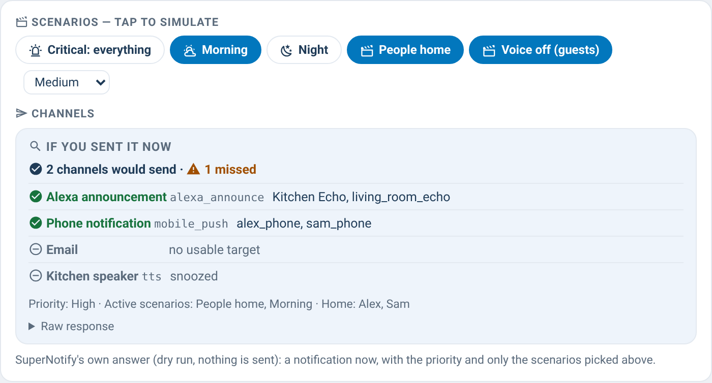

# supernotify-simulator-card

[← SuperNotify Cards](../../README.md) · [Common options](../configuration.md)

"Who receives?" — pick scenarios and see which deliveries would fire,
computed from real engine data (`enquire_implicit_deliveries` and
`enquire_deliveries_by_scenario`). Suppressed deliveries are shown
struck-through. Priority-based delivery filtering happens engine-side and
is not simulated.

For every channel it says why: *would go out* (starts on its own, turned on by a scenario) or
*would not go out* (turned off by a scenario, only when named in the call, only with a
scenario, backup, switched off).

**SuperNotify 2.12 or later:** the answer is SuperNotify's own - the same dry run as the composer's
*Try without sending* (`supernotify.notify` with `dry_run: simulate`, nothing is sent), with the
scenarios you pick applied and no other considered, and the priority you choose. It shows which
channels would send and to whom, which would not and why. `dry_run: false` keeps the estimate
described above.



```yaml
type: custom:supernotify-simulator-card
# dry_run: false   # optional: the estimate instead of SuperNotify's dry run
```
