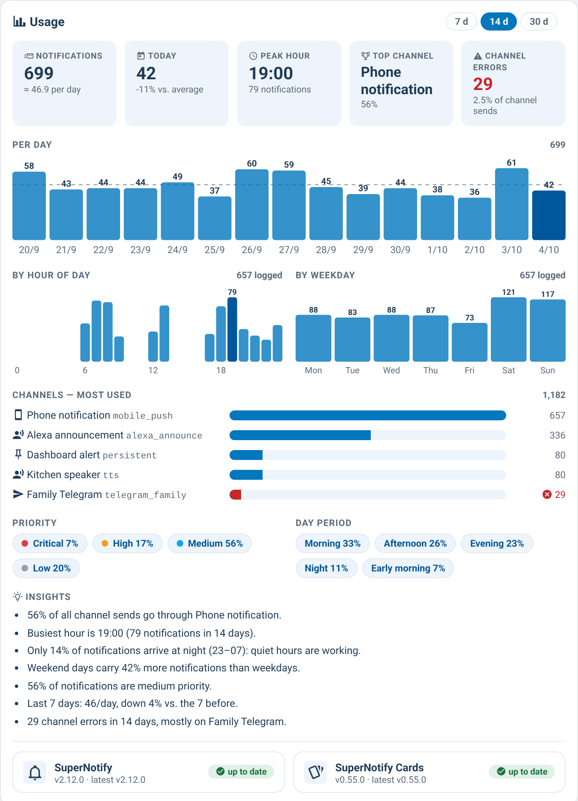

# supernotify-stats-card

[← SuperNotify Cards](../../README.md) · [Common options](../configuration.md)

Usage analytics built **only from entities that already exist** — no extra
sensor, no archive parsing: KPIs (notifications in the window, per day,
today vs. average, peak hour, top channel, channel errors), per-day /
per-hour / per-weekday bar charts, channels most used (with error share),
priority and day-period mix, auto-generated insights, and a version strip
showing installed vs. latest version of SuperNotify and of these cards
(from the HACS `update.*` entities, with their brand icon and release link).



Data sources:

- **Per-day series** — long-term statistics of a daily `utility_meter` on
  `sensor.supernotify_notifications` (survives recorder purges).
- **Per-notification detail** — recorder history of the "last notification"
  helpers written by a logging automation: one change of an
  `input_datetime` = one notification, joined with the priority / channels /
  day-period helpers at that moment. History length = your recorder
  `purge_keep_days`.
- **Channels** — an `input_text` written *after* delivery from
  `supernotify.enquire_last_notification` as `a, b, ✖c` (✖ = errored).

```yaml
type: custom:supernotify-stats-card
# optional (defaults shown):
days: 14
periods: [7, 14, 30]    # window switch in the header; the choice is remembered per browser
time_entity: input_datetime.supernotify_last_time
priority_entity: input_text.supernotify_last_priority
channels_entity: input_text.supernotify_last_channels
period_entity: input_text.supernotify_last_day_period
sent_today_entity: sensor.supernotify_sent_today      # daily utility_meter
update_entity: update.supernotify_update                # HACS update entity
cards_update_entity: update.supernotify_cards_update
refresh_minutes: 10
top_channels: 8
grid_options: { columns: full }   # recommended inside a column_span: 2 section
```

Minimal helpers + automations the card expects (adapt names to yours):

```yaml
input_text:
  supernotify_last_priority: { max: 20 }
  supernotify_last_channels: { max: 255 }
  supernotify_last_day_period: { max: 50 }
input_datetime:
  supernotify_last_time: { has_date: true, has_time: true }

utility_meter:
  supernotify_inviate_oggi:
    source: sensor.supernotify_notifications
    cycle: daily

automation:
  # 1) at call time: timestamp + priority (+ your own day-period sensor)
  - alias: SuperNotify - log last notification
    mode: queued
    trigger:
      - platform: event
        event_type: call_service
        event_data: { domain: notify, service: supernotify }
    action:
      - action: input_text.set_value
        target: { entity_id: input_text.supernotify_last_priority }
        data:
          value: "{{ (trigger.event.data.service_data.data | default({})).priority | default('medium') }}"
      - action: input_datetime.set_datetime
        target: { entity_id: input_datetime.supernotify_last_time }
        data: { datetime: "{{ now().isoformat() }}" }

  # 2) after delivery: channels that really delivered / errored
  - alias: SuperNotify - log delivered channels
    mode: queued
    trigger:
      - platform: state
        entity_id: sensor.supernotify_notifications
        not_to: [unknown, unavailable]
    action:
      - action: supernotify.enquire_last_notification
        response_variable: last
      - action: input_text.set_value
        target: { entity_id: input_text.supernotify_last_channels }
        data:
          value: >-
            
            
              
              
            
            {{ (ns.ok + ns.ko) | join(', ') if (ns.ok + ns.ko) | length > 0 else 'none' }}
```

Values the card cannot parse (e.g. an older "auto" placeholder) are counted
as *unknown* and shown as such under the channel chart.
