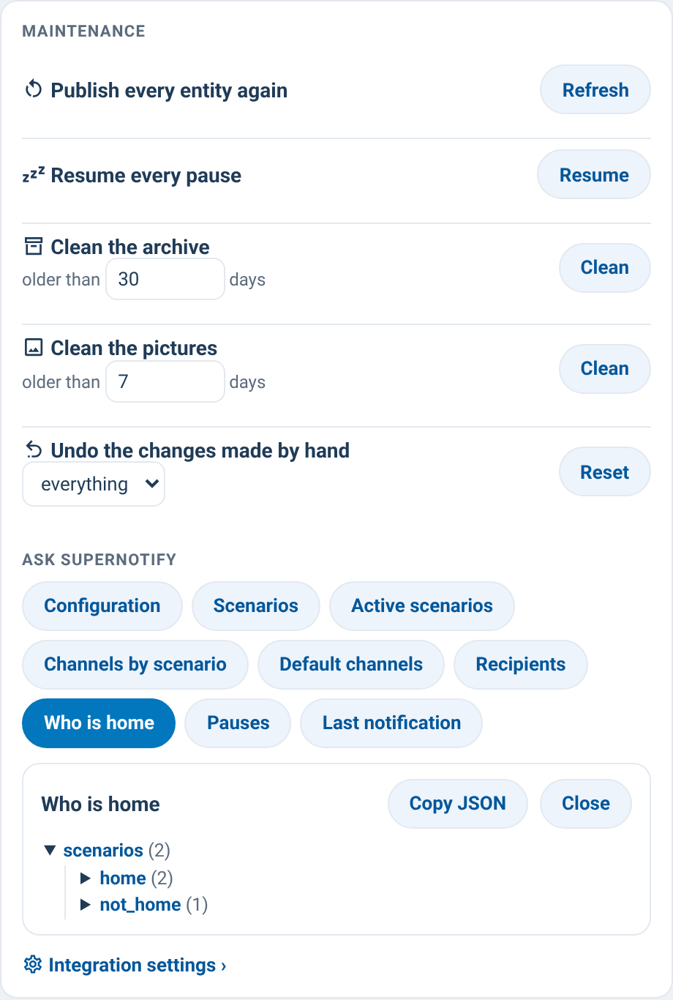

# supernotify-tools-card

[← SuperNotify Cards](../../README.md) · [Common options](../configuration.md)

SuperNotify's maintenance actions and its questions, from the dashboard,
with readable answers. No YAML, no Developer tools.



**Maintenance** — each button shows its result on the same row:

| Row | Action | Result |
| --- | --- | --- |
| Publish every entity again | `supernotify.refresh_entities` | done |
| Resume every pause | `supernotify.clear_snoozes` | how many pauses were resumed |
| Clean the archive older than *N* days | `supernotify.purge_archive` | deleted · left |
| Clean the pictures older than *N* days | `supernotify.purge_media` | deleted · left |
| Undo the changes made by hand (all, scenarios, channels, recipients, transports) | `supernotify.reset_overrides` | what was reset |

The two clean buttons and the reset ask for a second tap within 4 seconds.

**Ask SuperNotify** — one chip per `enquire_*` action (configuration,
scenarios, active scenarios, channels by scenario, default channels,
recipients, who is home, pauses, last notification). The answer opens as a
collapsible tree with **Copy JSON**.

On SuperNotify 2.12.0 *Configuration* fails when a channel has a template
condition ([#241](https://github.com/rhizomatics/supernotify/issues/241));
the card says so instead of showing a bare error.

The actions need an admin user, like the matching actions in HA.

```yaml
type: custom:supernotify-tools-card
# optional (defaults shown):
archive_days: 30   # starting value of "Clean the archive older than"
media_days: 7      # starting value of "Clean the pictures older than"
```
