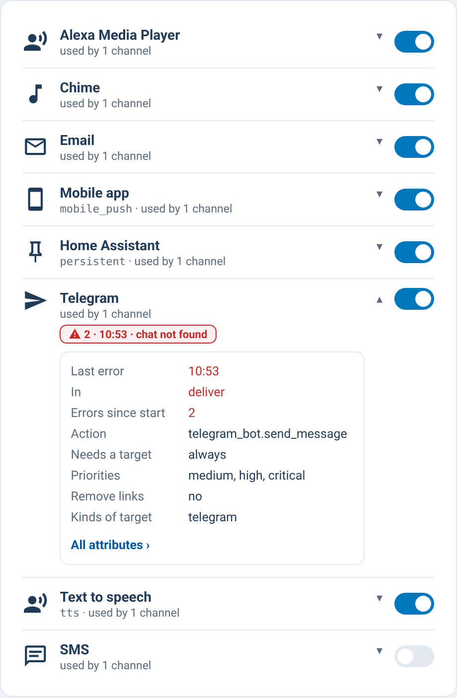

# supernotify-transports-card

[← SuperNotify Cards](../../README.md) · [Common options](../configuration.md)

The integrations behind the channels (mobile push, Alexa, email, Telegram…), each with its
on/off switch and the number of errors since the last restart. Turning a transport off stops
every channel that uses it.



An error shows how many, when the last one happened and its message. **Tap a row** for the detail:
the last error (when and in which step), the transport's defaults for its channels (action,
targets, priorities, options in plain words) and **All attributes ›** for Home Assistant's dialog.

```yaml
type: custom:supernotify-transports-card
```

To undo the changes made by hand (all, or only channels, transports…) use the
[tools card](tools.md) (0.65.0: the button left this card).
