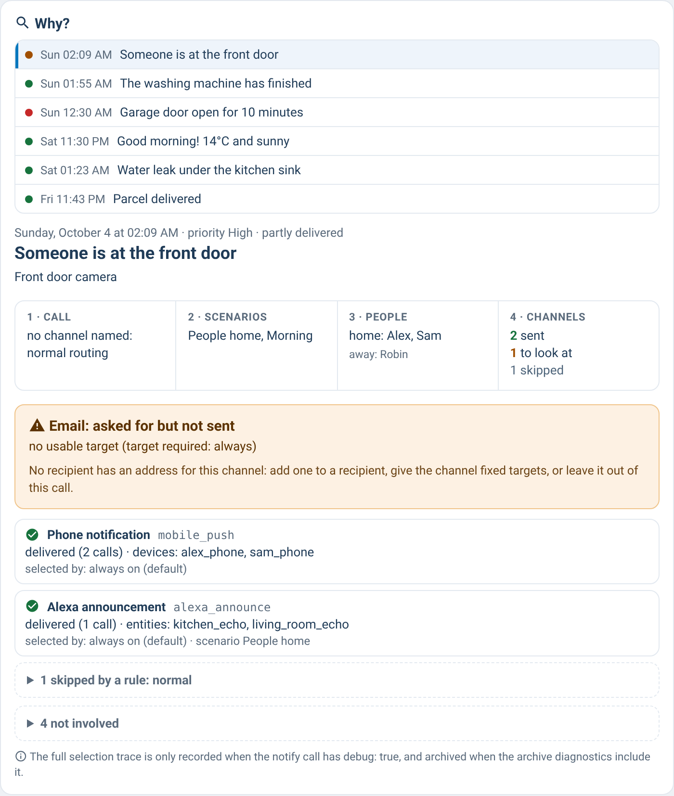

# supernotify-why-card

[← SuperNotify Cards](../../README.md) · [Common options](../configuration.md)

"Why did this notification go where it went?" Pick a notification (or open it from the archive
card or the recipients card) to see the scenarios in force, who was home, and for **every
channel** whether it went out, why not, to which targets and what selected it — plus the channels
that did not start at all, with the reason. When SuperNotify diagnostics are set to `ALL`, the
full selection trace archived with the notification is shown too.



```yaml
type: custom:supernotify-why-card
```

| Option | Required | Description |
|---|---|---|
| `limit` | no | notifications in the list (default 15) |
| `expand` | no | `true` opens the folded parts (routine skips, channels not involved, full trace) |
| `source`, `trigger_entity` | no | as for supernotify-archive-card |
| `entity` | no | bridge only: sensor holding the archive index |
| `service` | no | bridge only: service returning the detail (default `shell_command.sn_archive_detail`) |
| `intro`, `style`, `language` | no | as for the other cards |

On SuperNotify 2.10.0 or later the list and the detail both come from `supernotify.enquire_archive`,
through the same store as the archive card: opening a notification already listed needs no
further call. Before 2.10, the detail is read on demand through the bridge, so it never weighs on
any entity's attributes. It needs the same `tools/sn_archive_index.py` as the archive card and a
shell command returning its output (restart Home Assistant after adding it):

```yaml
shell_command:
  sn_archive_detail: "python3 /config/tools/sn_archive_index.py --detail {{ id }}"
```

The channels that did not start are not in the archive: their reason is reconstructed from the
configuration as it is now (delivery and transport switches, inclusion, the scenarios in force,
the call's own overrides) and is labelled as such, unless the archived trace says otherwise.
